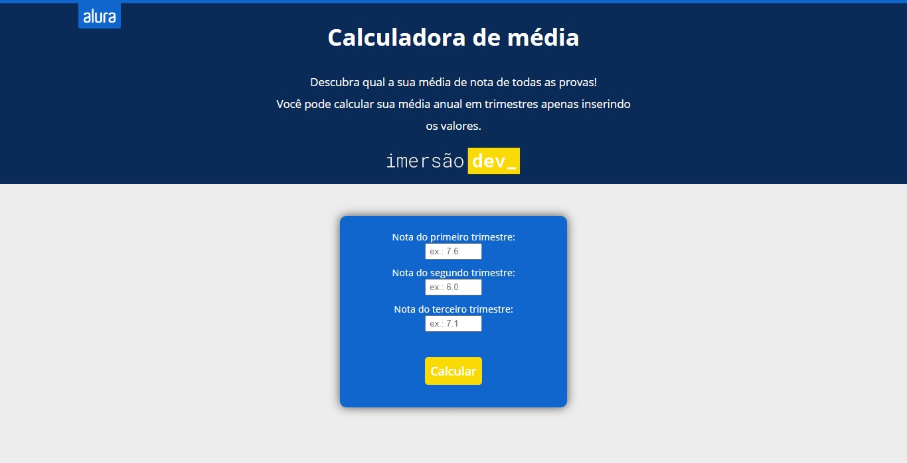

# Calculadora de Média - Imersão Dev

Essa é uma simples calculadora de média em trimestres, feita para a Imersão Dev, da Alura. 

## Conteúdos

- [Overview](#overview)
  - [O projeto](#o-projeto)
  - [Screenshot](#screenshot)
  - [Links](#links)
- [Processo](#processo)
  - [Feito com](#feito-com)
  - [Aprendizado](#aprendizado)
  - [Desenvolvimento contínuo](#desenvolvimento-contínuo)
- [Autor](#autor)

## Overview

### O projeto

- Usando HTML, CSS e JavaScript, fazer uma calculadora com propósito de calcular a média de um aluno (baseando-se [neste código](https://codepen.io/imersao-dev/pen/QWgppMM))

### Screenshot

### Links

- [URL do Site](https://luizhf42.github.io/calculadora-de-media)

## Processo

### Feito com

- HTML5
- CSS3
- Flexbox
- JavaScript

### Aprendizado

Esse foi um projeto que, além de útil para melhora no desenvolvimento de design, também ajudou-me a praticar mais minha lógica de programação com JS.

### Desenvolvimento contínuo

Em geral, dois pontos importantes que continuarei treinando são a codificação de layouts e lógica de programação (além do próprio JavaScript)

## Autor

- Propriamente eu, Luiz Henrique.
